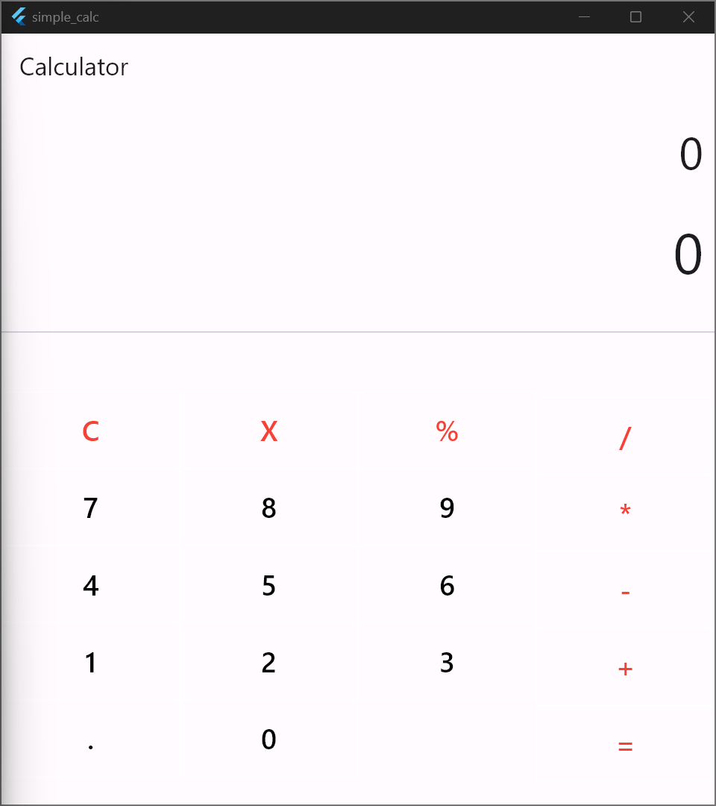
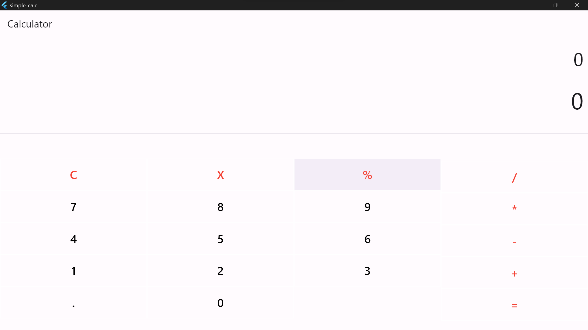
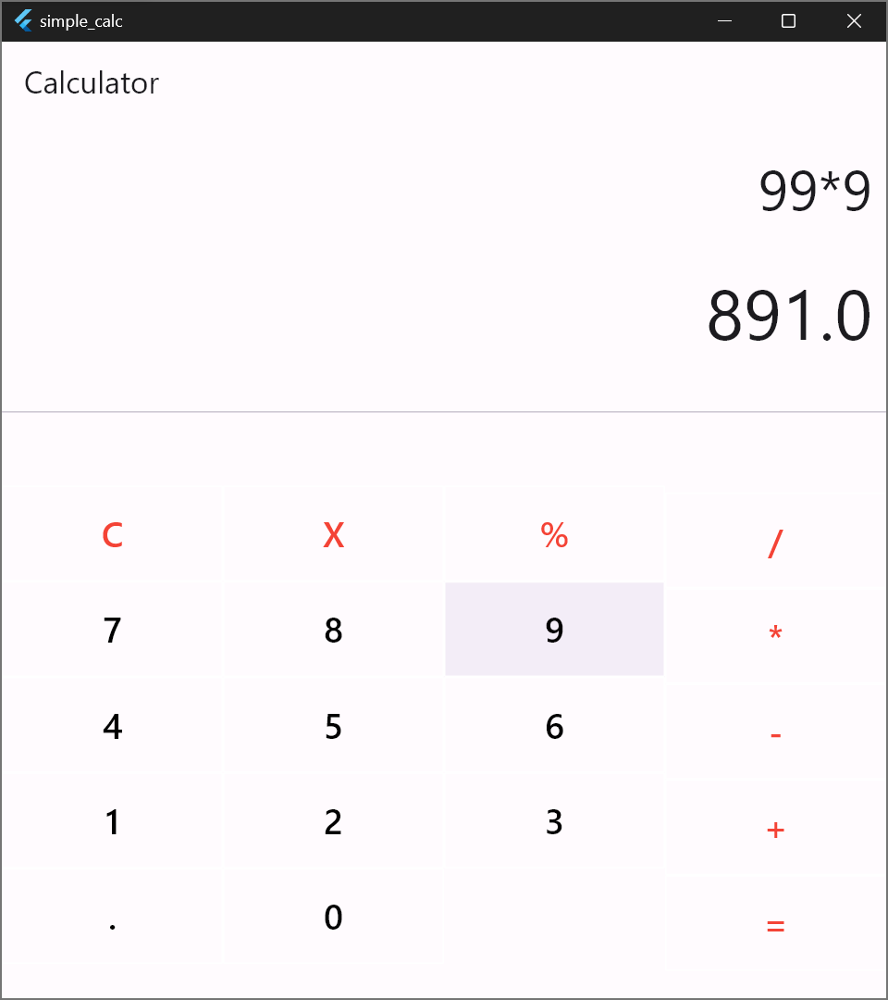
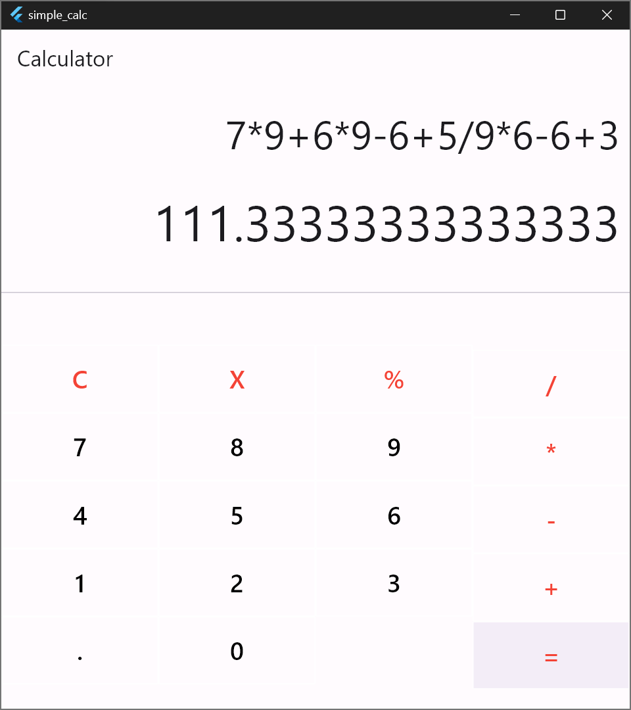

# Simple Calculator

This is a simple calculator project made in Flutter

## Demos

### Demo1
 

### Demo2
 

### Demo3
 

### Demo4

## Getting Started
1. Install `git` and `flutter`
2. Clone the repo: `git clone https://github.com/samh7/simple_calc.git`
3. `cd simple_calc`
4. Run the project: `flutter run`

